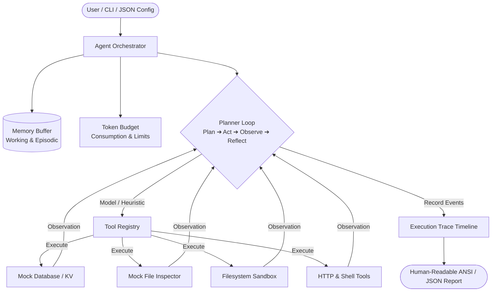

[🇸🇦 العربية](README.ar.md) | [🇬🇧 English](README.md)

# 🧠 eidcloud-agent-runtime

> **Topics:** `eidcloud` `ai-agents` `agent-runtime` `tool-calling` `llm-orchestrator` `autonomous-agents` `php8`

[](https://github.com/shadialhasan/eidcloud-agent-runtime/releases)
[](https://www.php.net)
[](LICENSE)
[](https://colab.research.google.com/github/shadialhasan/eidcloud-agent-runtime/blob/main/notebooks/quickstart.ipynb)

A high-performance, model-agnostic autonomous AI agent runtime built in pure **PHP 8.2+** with **zero external vendor dependencies**. `eidcloud-agent-runtime` provides robust prompt orchestration, step-by-step planner execution, tool dispatching with permission boundaries, dual memory systems, token budgeting, and structured execution tracing.

---

## 🏛️ Architecture Overview



---

## ⚡ Core Capabilities

- **Zero External Dependencies**: Pure standard library PHP 8.2+ with native PSR-4 autoloader. Runs anywhere without composer vendor bloat.
- **Model-Agnostic & Dry-Run Mode**: Built-in intelligent mock simulation engine allows full development, testing, and dry-run execution without consuming third-party API keys.
- **Extensible Tool Registry**:
  - `mock_database`: Key-value and relational querying, counting, and insertion simulation.
  - `mock_file_inspector`: Virtual file discovery and line count metrics.
  - `mock_calculator`: Arithmetic and expression evaluation.
  - `mock_search`: Keyword-indexed knowledge base simulation.
  - `filesystem`: Path-confined sandboxed directory traversal, read, write, and line count operations.
  - `http_request`: Native HTTP/REST client with timeout and domain whitelisting.
  - `shell_execute`: Command runner with strict prefix whitelisting and process timeout enforcement.
- **Dual-State Memory Engine**:
  - *Working Memory*: Dynamic key-value scratchpad for intermediate task variables.
  - *Episodic Memory*: Chronological turns recording thoughts, plans, actions, observations, and reflections.
- **Token Budget Accounting**: Real-time prompt, tool input/output, and completion token tracking with configurable warning thresholds and hard limits.
- **Structured Execution Tracing**: Nanosecond-precision event timeline recording latency (`duration_ms`), tool IO, token metrics, and exportable to ANSI tables or JSON.
- **CLI Executable (`bin/eidcloud-agent`)**: Ergonomic command-line runner supporting flags, configuration files, and machine-readable pipelines.

---

## 🚀 Installation & Setup

### Requirements
- **PHP 8.2** or higher (with `curl`, `mbstring`, and `json` extensions).

### 1. Clone or Download
```bash
git clone https://github.com/shadialhasan/eidcloud-agent-runtime.git
cd eidcloud-agent-runtime
```

### 2. Autoloading
The runtime operates out of the box with zero external dependencies. Include the standalone autoloader or Composer:

```php
require_once __DIR__ . '/src/autoload.php';
// Or if installed via Composer:
// require_once __DIR__ . '/vendor/autoload.php';
```

---

## 💻 CLI Usage

The executable script `bin/eidcloud-agent` provides direct terminal access to the agent runtime:

### 1. Run Mock Simulation Task
```bash
php bin/eidcloud-agent run --task="Inspect project files and count lines" --mock
```

### 2. Stream Machine-Readable JSON Trace
Pipe structured execution traces directly into logs, file storage, or downstream tools:
```bash
php bin/eidcloud-agent run --task="Inspect project files and count lines" --mock --json
```

### 3. Run from Agent Configuration File
```bash
php bin/eidcloud-agent run agent.example.json
```

### 4. Custom Token Budget and Step Limits
```bash
php bin/eidcloud-agent run --task="Query database records" --mock --token-budget=4096 --max-steps=5 -v
```

### 5. CLI Help
```bash
php bin/eidcloud-agent --help
```

---

## 🧩 PHP API Usage

### Quickstart with Mock Agent
```php
<?php

require_once __DIR__ . '/src/autoload.php';

use EidCloud\AgentRuntime\Core\Agent;

// Initialize mock agent
$agent = Agent::createMockAgent('Inspect project files and count lines');

// Run planner loop
$result = $agent->run();

// Display results
echo "Final Answer: " . $result['answer'] . PHP_EOL;
echo "Tokens Used: " . $result['token_stats']['total_used'] . PHP_EOL;

// Display formatted execution trace
echo $agent->getTrace()->toPrettyString();
```

### Creating Custom Tools
```php
<?php

use EidCloud\AgentRuntime\Tools\AbstractTool;

class WeatherTool extends AbstractTool
{
    public function __construct()
    {
        $this->name = 'get_weather';
        $this->description = 'Retrieve weather forecast for a city.';
        $this->parameters = [
            'type' => 'object',
            'properties' => [
                'city' => ['type' => 'string', 'description' => 'Target city name'],
            ],
            'required' => ['city'],
        ];
    }

    public function execute(array $args): array|string
    {
        $this->validateRequired($args, ['city']);
        return [
            'city' => $args['city'],
            'temp_c' => 24.5,
            'condition' => 'Clear sky',
        ];
    }
}
```

### Registering Custom Tools & Setting LLM Driver
```php
<?php

use EidCloud\AgentRuntime\Core\Agent;
use EidCloud\AgentRuntime\Core\Config;

$agent = new Agent(new Config([
    'task' => 'Check current weather in Damascus',
    'mock' => false,
    'token_budget' => 4096,
]));

// Register custom tool
$agent->getToolRegistry()->register(new WeatherTool());

// Attach an LLM driver (e.g. OpenAI, Anthropic, Gemini, or Local EidCloud Model)
$agent->setLlmDriver(function (array $context, array $tools): array {
    // 1. Send context and tools to your LLM endpoint
    // 2. Return decision: ['type' => 'tool_call', 'tool' => 'get_weather', 'args' => ['city' => 'Damascus']]
    // 3. Or return answer: ['type' => 'answer', 'answer' => 'It is 24.5°C in Damascus.']
    return [
        'type' => 'tool_call',
        'tool' => 'get_weather',
        'args' => ['city' => 'Damascus'],
        'thought' => 'I will fetch the weather conditions for Damascus.',
        'final_step' => true,
    ];
});

$result = $agent->run();
print_r($result);
```

---

## 🧪 Running Tests

The test suite runs with zero third-party dependencies using the built-in test runner:

```bash
php tests/run_tests.php
```

Output:
```
=================================================================
        🧪 EidCloud Agent Runtime - Automated Test Suite        
=================================================================

Testing: AgentRuntimeTest
  ✔ testTokenBudgetAccounting (7.87ms)
  ✔ testMemoryBufferOperations (1.33ms)
  ✔ testMockToolsFunctionality (3.19ms)
  ✔ testToolRegistryAndPermissions (0.99ms)
  ✔ testFilesystemToolSandboxing (5.41ms)
  ✔ testExecutionTrace (20.62ms)
  ✔ testAgentFullExecutionProjectInspection (5.82ms)
  ✔ testAgentFullExecutionDatabaseTask (0.35ms)
  ✔ testAgentFullExecutionMathTask (0.50ms)
  ✔ testAgentConfigFromJsonFile (0.42ms)

-----------------------------------------------------------------
✓ PASSED ALL TESTS (100%)
  Tests:      10 passed, 10 total
  Assertions: 82
  Duration:   49.70ms
  Memory:     2.00MB
=================================================================
```

---

## 👤 Author & Maintainer

**Eng. MHD. Shadi AL-Hasan**  
- **Role:** Executive CTO & Enterprise Solutions Architect  
- **Email:** [mhd.shadi.alhasan@gmail.com](mailto:mhd.shadi.alhasan@gmail.com)  
- **Phone / WhatsApp:** [+963934005922](tel:+963934005922)  
- **Location:** Damascus, Syria  
- **GitHub:** [shadialhasan](https://github.com/shadialhasan)  

---

## 📄 License

This project is licensed under the MIT License - see the [LICENSE](LICENSE) file for details.  
Copyright (c) 2026 **MHD. Shadi AL-Hasan**. All rights reserved.
